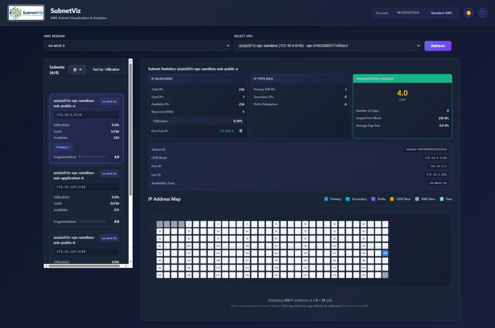

# SubnetViz v1.0.0

[](LICENSE)

A modern web application for visualizing and analyzing AWS subnet IP allocation, fragmentation, and utilization patterns. SubnetViz helps you identify allocation inefficiencies, optimize IP block usage, and plan infrastructure for large-scale EKS deployments.

**Designed for both local development and production deployment** via Docker (local, ECS, Fargate).



## Why this tool?

I developed this application due to the lack of a simple tool for displaying IP allocation in multiple VPCs within AWS accounts. I often tried to see which IPs were available in a subnet, how fragmented the subnet was, and so on.

If you think some useful information could be added to this application, create a [feature request](https://github.com/bartleboeuf/subnetwiz/issues) in this GitHub repository.

## Features

### Core Capabilities
- **VPC & Subnet Overview**: Browse all VPCs and subnets with IP usage statistics and metadata
- **IP Allocation Visualization**: Interactive grid showing each IP address color-coded by status (used/free/reserved)
- **Fragmentation Analysis**: Calculate fragmentation scores (0-100) measuring IP allocation efficiency
- **Advanced Filtering & Sorting** (Phase 15):
  - **Filters**: Search by name, filter by Availability Zone, utilization range, fragmentation level, **IP address containment**, and **tag values**
  - **Sorts**: By utilization, fragmentation, name, **subnet tags**, or **CIDR range** (by address or size)
  - **Collapsible UI**: Tag filters with expand/collapse and scrollable container for many tags
- **EKS Support**: Track primary IPs, secondary IPs, and prefix delegation IPs (/28 blocks)
- **Large Subnet Support**: Handle /16+ subnets (65K+ IPs) with pagination and async processing
- **Multi-Region**: Query any AWS region via query parameter or environment variable
- **Real-Time Data**: Live data from AWS EC2 API with intelligent response caching
- **Dark/Light Theme**: Professional UI with theme toggle and responsive design
- **Copy to Clipboard**: Click any IP or metric to copy details instantly
- **AWS Partition Support**: All current AWS Partitions are supported even the new AWS European Sovereign Cloud

### Technical Features
- **High Performance**: Connection pooling, parallel API calls, response caching
- **Scalable Backend**: Async processing, pagination, memory-optimized large subnet operations
- **Responsive Frontend**: React 18.3 with lazy loading, virtualized lists, smooth animations
- **Security**: Input validation on all parameters, minimal IAM permissions (read-only EC2)
- **Error Handling**: Specific HTTP status codes with descriptive messages
- **Health Checks**: Included for container health monitoring
- **Production Ready**: Docker containerization, security headers, resource optimization

## Quick Start

### Prerequisites

Choose your deployment method:

| Method | Requirements |
|--------|--------------|
| **Docker** (Recommended) | Docker Engine, AWS credentials |
| **Local Development** | Python 3.11+, Node.js 24+, AWS credentials |

### AWS Permissions

The application requires read-only EC2 access:

```json
{
  "Version": "2012-10-17",
  "Statement": [
    {
      "Effect": "Allow",
      "Action": [
        "ec2:DescribeVpcs",
        "ec2:DescribeSubnets",
        "ec2:DescribeNetworkInterfaces",
        "ec2:GetSubnetCidrReservations"
      ],
      "Resource": "*"
    }
  ]
}
```

### Option 1: Docker (Production & Local Testing)

```bash
# Build the image
docker build -t subnetviz:1.0.0 .

# Run locally with AWS credentials
docker run -it --rm \
  -p 5000:5000 \
  -e AWS_DEFAULT_REGION=us-east-1 \
  -v ~/.aws:/root/.aws:ro \
  subnetviz:1.0.0

# Access the application
# http://localhost:5000
```

For AWS credentials via environment variables:
```bash
docker run -it --rm \
  -p 5000:5000 \
  -e AWS_ACCESS_KEY_ID=your_key \
  -e AWS_SECRET_ACCESS_KEY=your_secret \
  -e AWS_DEFAULT_REGION=us-east-1 \
  subnetviz:1.0.0
```

### Option 2: Local Development

```bash
# Install backend dependencies
pip install -r requirements.txt

# Install frontend dependencies
cd frontend
npm install
cd ..

# Terminal 1: Start backend
python app.py
# Backend runs on http://localhost:5000

# Terminal 2: Start frontend dev server
cd frontend
npm start
# Frontend dev server on http://localhost:3000
```

## Deployment

### Docker Image

The included `Dockerfile` uses multi-stage build for optimal production images:
- Base: Python 3.14-slim (security updates, minimal size)
- Frontend: Built with Node.js, optimized for production
- Single container with both backend API and frontend UI

```bash
# Build for production
docker build -t subnetviz:1.0.0 .

# Test locally
docker run -it --rm -p 5000:5000 -v ~/.aws:/root/.aws:ro subnetviz:1.0.0
```

### ECS / Fargate Deployment

SubnetViz is designed for containerized deployment in AWS:

**Prerequisites:**
- ECR repository to store the image
- ECS cluster (EC2 or Fargate launch type)
- IAM role with EC2 describe permissions
- Security group allowing port 5000 (or ALB target group)

**Steps:**
1. Build and push image to ECR
2. Create ECS task definition with the image
3. Configure environment variables (AWS_DEFAULT_REGION, AWS_PROFILE if using assumed roles)
4. Mount credentials via IAM task role (recommended) or environment variables
5. Expose port 5000 to ALB/NLB

See [Deployment Examples](#deployment-examples) for details.

## API Endpoints

All endpoints support multi-region queries:
- Query parameter: `?region=us-west-2`
- Header: `X-AWS-Region: us-west-2`
- Default: `AWS_DEFAULT_REGION` env var or `us-east-1`

### Available Endpoints

| Endpoint | Method | Description | Cache |
|----------|--------|-------------|-------|
| `/api/health` | GET | Health check + environment info | No |
| `/api/regions` | GET | List available AWS regions | 1 hour |
| `/api/vpcs` | GET | List all VPCs in region | 5 min |
| `/api/vpc/<vpc_id>/subnets` | GET | Subnets with usage stats + tags | No |
| `/api/subnet/<subnet_id>/ips` | GET | All IPs in subnet | No |
| `/api/subnet/<subnet_id>/ips/paginated` | GET | Paginated IPs (offset, limit) | No |
| `/api/account-info` | GET | Account ID and partition info | No |

### Example Usage

```bash
# List VPCs in a region
curl http://localhost:5000/api/vpcs?region=us-west-2

# Get subnets for a VPC
curl http://localhost:5000/api/vpc/vpc-12345/subnets

# Get paginated IPs (5000 IPs per page)
curl http://localhost:5000/api/subnet/subnet-67890/ips/paginated?offset=0&limit=5000

# Health check
curl http://localhost:5000/api/health
```

## Configuration

### Environment Variables

| Variable | Description | Default |
|----------|-------------|---------|
| `AWS_DEFAULT_REGION` | AWS region to query | `us-east-1` |
| `AWS_PROFILE` | AWS credentials profile | `default` |
| `AWS_ACCESS_KEY_ID` | AWS access key (alternative to profile) | - |
| `AWS_SECRET_ACCESS_KEY` | AWS secret key (alternative to profile) | - |
| `PORT` | Server port | `5000` |
| `FLASK_DEBUG` | Enable debug mode (dev only) | `False` |
| `FLASK_ENV` | Environment (development/production) | `production` |

### Example: Fargate Environment

```
AWS_DEFAULT_REGION=us-east-1
PORT=5000
FLASK_ENV=production
```

Task role provides EC2 permissions automatically.

## Usage

### Navigating the Interface

1. **Region Selector** (top-left): Choose AWS region
2. **VPC Selector** (top-left): Choose VPC to analyze
3. **Sort Selector** (top-right): Choose sort order
   - By Utilization, Fragmentation, Name
   - By Tag (with dynamic tag key selector)
   - By CIDR Range (by address or by size)
4. **Subnet List** (left panel):
   - Shows all subnets with utilization % and fragmentation score
   - **Collapsible filter panel (⚙️)** with advanced options:
     - Search by subnet name
     - Filter by IP address (CIDR containment)
     - Filter by Availability Zone (2-column layout)
     - Filter by utilization range (sliders)
     - Filter by fragmentation level (Low/Moderate/High)
     - Filter by tag values (collapsible, scrollable)
   - Click subnet to view IP map
5. **IP Visualization** (right panel):
   - Color-coded blocks for each IP
   - Hover for details
   - Click to copy details to clipboard
6. **Statistics** (right panel):
   - IP allocation breakdown
   - Fragmentation analysis
   - First/last free IP

### Using Advanced Filters

**All filters use AND logic** - a subnet must pass ALL active filters to be displayed.

**Examples:**
- Search "prod" + Filter AZ "us-east-1a" = Show subnets with "prod" in name in us-east-1a only
- Filter IP "10.0.1.50" + Filter Tag "Environment=prod" = Show prod subnets containing that IP
- Filter Utilization 50-80% + Sort by Fragmentation = Show moderately utilized subnets, sorted by fragmentation

**Tag Filtering:**
- Click tag key to expand/collapse and see available values
- Badge shows count of selected filters per tag
- Scroll in tag container to see all tags even with limited space

### Color Legend

| Color | Meaning |
|-------|---------|
| **Blue** | Primary ENI IPs (EC2 instances) |
| **Cyan** | Secondary IPs (EKS pods) |
| **Purple** | Prefix delegation IPs (/28 blocks for EKS) |
| **Gray** | AWS reserved IPs (.0, .1, .2, .3, broadcast) |
| **Light Gray** | Free/available IPs |

### Fragmentation Score

- **0-20 (Green)**: Low fragmentation, good for large allocations
- **21-50 (Orange)**: Moderate fragmentation, scattered IPs
- **51-100 (Red)**: High fragmentation, difficult to allocate large blocks

## Performance Characteristics

| Subnet Size | First Load | Full Load | Notes |
|-------------|-----------|----------|-------|
| /24 (256 IPs) | <100ms | <100ms | Instant |
| /20 (4K IPs) | <500ms | <500ms | Very fast |
| /16 (65K IPs) | <2s | 30-60s | Paginated, background loading |

**Optimizations:**
- Connection pooling (50 max connections per region)
- Parallel AWS API calls (thread pool, 5 workers)
- Response caching (VPCs: 5 min, regions: 1 hour)
- Frontend pagination (5K IPs per page)
- Async chunk processing (prevent UI blocking)

## Security

### Input Validation
- All AWS resource IDs validated against AWS naming conventions
- Invalid IDs return 400 Bad Request
- No SQL injection or command injection possible (read-only API)

### Data Security
- HTTPS for all AWS API calls
- No sensitive data cached
- Security headers on all responses (X-Content-Type-Options, X-Frame-Options)

### Access Control
- Read-only EC2 permissions only
- No data modification capability
- IAM role required for Fargate (no shared credentials)

### Error Responses

```
400: Invalid input (malformed ID, invalid region)
403: Permission denied (missing EC2 permissions)
404: Resource not found (VPC/subnet doesn't exist)
429: Rate limited (too many AWS API requests)
500: Server error (unexpected condition)
503: AWS service unavailable
504: Request timeout (>30 seconds)
```

## Troubleshooting

### Common Issues

**"Failed to fetch VPCs"**
- Verify AWS credentials: `aws sts get-caller-identity`
- Check IAM permissions (ec2:Describe* needed)
- Ensure correct region is selected

**"Invalid ID format"**
- IDs must be AWS format (vpc-abc123, subnet-xyz789)
- Verify you're using correct resource type

**"Permission denied" (403)**
- Check IAM policy includes required EC2 permissions
- For Fargate, verify task role is attached

**Docker won't start**
```bash
# Check Docker daemon
docker ps

# Rebuild image
docker build --no-cache -t subnetviz:1.0.0 .

# Check logs
docker run -it subnetviz:1.0.0
```

**Frontend shows "Frontend not built yet"**
```bash
# Rebuild Docker image
docker build --no-cache -t subnetviz:1.0.0 .
```

## Development

### Project Structure

```
.
├── app.py                           # Flask backend API (VPC/subnet/IP data)
├── requirements.txt                 # Python dependencies
├── Dockerfile                       # Multi-stage production build
├── README.md                        # This file
├── LICENSE                          # MIT License
├── img/
│   └── subnetviz-screen.png         # UI screenshot
├── frontend/
│   ├── package.json                 # Node.js dependencies
│   ├── package-lock.json            # Locked npm versions
│   ├── public/
│   │   ├── index.html               # HTML entry point
│   │   ├── favicon.ico              # App icon
│   │   └── manifest.json            # PWA manifest
│   ├── src/
│   │   ├── App.js                   # Main React component
│   │   ├── App.css                  # App styling
│   │   ├── index.js                 # React entry point
│   │   ├── components/
│   │   │   ├── About.js             # About dialog
│   │   │   ├── IpVisualization.js   # IP grid visualization
│   │   │   ├── IpVisualization.css  # IP grid styling
│   │   │   ├── RegionSelector.js    # Region dropdown
│   │   │   ├── Statistics.js        # IP stats panel
│   │   │   ├── Statistics.css       # Stats styling
│   │   │   ├── SubnetList.js        # Subnet list with filters & sorts
│   │   │   ├── SubnetList.css       # Subnet list styling
│   │   │   ├── VpcSelector.js       # VPC dropdown
│   │   │   └── ...
│   │   └── utils/
│   │       └── api.js               # API client utilities
└── .gitignore                       # Git ignore rules
```

### Local Development Setup

```bash
# Backend
pip install -r requirements.txt
export FLASK_DEBUG=True
python app.py

# Frontend (new terminal)
cd frontend
npm install
npm start
```

### Building for Production

```bash
# Build Docker image
docker build -t subnetviz:1.0.0 .

# Test production build
docker run -it --rm -p 5000:5000 -v ~/.aws:/root/.aws:ro subnetviz:1.0.0

# Push to ECR (example)
aws ecr get-login-password --region us-east-1 | \
  docker login --username AWS --password-stdin 123456789.dkr.ecr.us-east-1.amazonaws.com

docker tag subnetviz:1.0.0 123456789.dkr.ecr.us-east-1.amazonaws.com/subnetviz:1.0.0
docker push 123456789.dkr.ecr.us-east-1.amazonaws.com/subnetviz:1.0.0
```

## Deployment Examples

### ECS Fargate Task Definition (Outline)

```json
{
  "family": "subnetviz",
  "networkMode": "awsvpc",
  "requiresCompatibilities": ["FARGATE"],
  "cpu": "512",
  "memory": "1024",
  "taskRoleArn": "arn:aws:iam::123456789:role/SubnetVizTaskRole",
  "containerDefinitions": [
    {
      "name": "subnetviz",
      "image": "123456789.dkr.ecr.us-east-1.amazonaws.com/subnetviz:1.0.0",
      "portMappings": [
        {
          "containerPort": 5000,
          "protocol": "tcp"
        }
      ],
      "environment": [
        {
          "name": "AWS_DEFAULT_REGION",
          "value": "us-east-1"
        },
        {
          "name": "PORT",
          "value": "5000"
        }
      ],
      "logConfiguration": {
        "logDriver": "awslogs",
        "options": {
          "awslogs-group": "/ecs/subnetviz",
          "awslogs-region": "us-east-1",
          "awslogs-stream-prefix": "ecs"
        }
      }
    }
  ]
}
```

### Local Docker with AWS Credentials

```bash
# Using AWS CLI profile
docker run -it --rm \
  -p 5000:5000 \
  -e AWS_PROFILE=my-profile \
  -e AWS_DEFAULT_REGION=us-east-1 \
  -v ~/.aws:/root/.aws:ro \
  subnetviz:1.0.0

# Using environment variables
docker run -it --rm \
  -p 5000:5000 \
  -e AWS_ACCESS_KEY_ID=AKIA... \
  -e AWS_SECRET_ACCESS_KEY=... \
  -e AWS_DEFAULT_REGION=us-east-1 \
  subnetviz:1.0.0
```

## License

MIT License - See LICENSE file for details.

## Version

**v1.0.0** - March 2026

Initial release with:
- VPC/subnet visualization and filtering
- IP fragmentation analysis
- EKS support (primary, secondary, prefix IPs)
- Large subnet pagination (up to /16)
- Multi-region support
- Docker containerization
- Dark/light theme
- Production-ready security and error handling
- Advanced Sort Options: By subnet tags, CIDR range (address or size)
- Advanced Filters: By IP address (containment check), tag values

---

**Questions?** Check [QUICKSTART.md](QUICKSTART.md) for step-by-step setup, or review API documentation above.
